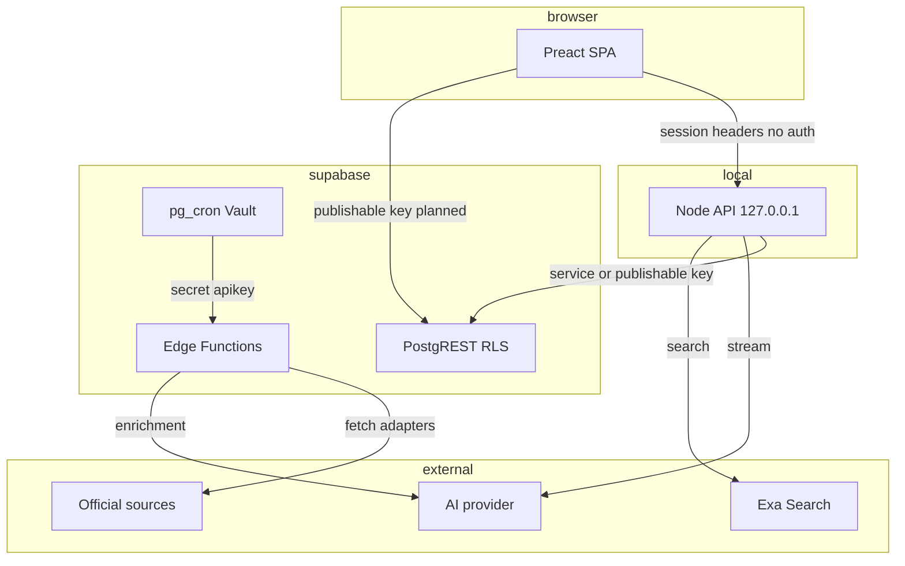

# Threat Model — Tajikistan Monitor

Ветка: `security/audit-task24` · Задача PLAN.md: Task 24 «Безопасность API и Supabase» · Роль: SOL · Дата: 2026-08-23

## Executive summary

Три главные проблемы: (1) **реальный ключ Exa Search закоммичен** в `.env.example` и присутствует в истории git (коммит `b492034`) — требует немедленной ротации; (2) **RLS-политики chat-таблиц содержат тавтологию** `session_id = coalesce(..., session_id)`, которая при отсутствии заголовка разрешает роли `anon` полный доступ ко ВСЕМ диалогам и сообщениям через PostgREST, а `anon` ошибочно получил `insert/update/delete`; (3) **Node-сервер чата не проверяет владение** на message-маршрутах и склеивает клиентские идентификаторы в PostgREST-запросы (IDOR + query-инъекция). Ingestion-контур (edge functions, миграции, адаптеры) спроектирован заметно аккуратнее и является образцом для остального кода.

## Scope and assumptions

**In scope:** `server/`, `supabase/` (functions + migrations), `src/` (lib, components), `index.html`, `vercel.json`, `.env*`, git-история, `dist/` (проверка на секреты), `package.json`.

**Out of scope:** Supabase-проект в облаке (настроения ключей/политик вне репозитория проверить нельзя), аккаунт Exa, провайдер AI, `node_modules`.

Допущения (подтвердить владельцем):

- Продакшн-цель — Vercel (статика) + Supabase; Node-сервер — переходный локальный адаптер (PLAN.md §3) и публично не развёрнут. Сегодня он слушает только `127.0.0.1` (`server/index.mjs:1226`), что смягчает IDOR/безлимит до «один локальный пользователь».
- `EXA_API_KEY` в `.env.example:7` — реальный действующий ключ (формат Exa UUID; тот же префикс в истории и в локальном `.env`).
- Публикация publishable-ключа в браузере планируется (PLAN.md §Supabase), т.е. PostgREST-экспозиция станет публичной.
- Аутентификации пользователей нет и в MVP не планируется (anon-модель, session_id вместо владельца).

Открытые вопросы, влияющие на приоритеты:

1. Развёрнут ли Node-сервер (`server/index.mjs`) где-либо, кроме localhost?
2. Выдан ли кому-то publishable-ключ Supabase / входит ли он в собранный фронтенд вне этого репозитория?
3. Использовался ли утёкший Exa-ключ в других проектах?

## System model

### Primary components

| Компонент | Назначение | Evidence |
|---|---|---|
| Preact SPA (Vite) | Карта, лента, AI-chat UI; рендер markdown без сырого HTML | `src/main.tsx`, `src/components/MarkdownContent.tsx` |
| Node API (переходный) | News/status/weather/rates, AI-стримы, chat CRUD + persistence; только 127.0.0.1 | `server/index.mjs` |
| Supabase PostgREST | public-таблицы с RLS; чтение publishable-ключом, запись сервисным | `supabase/migrations/*` |
| Edge Functions | `ingest-dispatcher` / `ingest-worker`: требуют `sb_secret_`-apikey | `supabase/functions/*/index.ts:14,24` |
| pg_cron + pg_net | Раз в минуту дергают функции секретом из Vault | `20260815042534…scheduler.sql:184` |
| Внешние сервисы | OpenAI-compatible провайдер, Exa Search, официальные сайты, Google Fonts/Favicons | `server/lib/openai-stream.mjs`, `place-research.mjs` |

### Data flows and trust boundaries

- **Браузер → Node API** (`/api/*`, `x-session-id`, `x-user-id`). HTTP, без аутентификации и CORS-заголовков; тело ограничено (128–512 КБ); rate limit только на place-research (8/10 мин). `server/index.mjs:1090-1221`.
- **Node API → Supabase PostgREST.** Ключ: `SUPABASE_SERVICE_ROLE_KEY || SUPABASE_PUBLISHABLE_KEY` — при сервисном ключе RLS обходится целиком; `x-session-id` в запрос **не пробрасывается**. `server/lib/chat-persistence.mjs:11,65-79`.
- **Браузер → Supabase PostgREST (план).** Publishable-ключ; безопасность целиком на RLS, которая в chat-таблицах сломана (см. TM-002).
- **pg_cron → Edge Functions.** Секрет `sb_secret_…` из Vault; формат ключа проверяется, реальная авторизация — валидацией ключа самим Supabase (`PGRST301/302`).
- **Edge Functions / Node-сервер → внешние источники.** Фиксированные URL из `sources`, UA, таймауты, лимит 3 МБ (`server/lib/html.mjs` `fetchTextWithRetry`); Exa — фиксированный URL, но вызов из `search_web_exa` без таймаута (TM-006).
- **AI-провайдер ← недоверенный контент.** Тексты статей передаются как данные; в `place-research` есть явный untrusted-промпт (`server/lib/place-research.mjs:145`), в `explainNews` — нет (`server/index.mjs:130`).

#### Diagram

## Assets and security objectives

| Asset | Why it matters | Objective (C/I/A) |
|---|---|---|
| `OPENAI_API_KEY`, `EXA_API_KEY`, service-role ключ | Прямые деньги (spend) и доступ к данным | C — не публиковать ни в git, ни в bundle |
| Chat-диалоги и сообщения (Supabase + `.chat_store.json`) | Личные вопросы пользователей; целостность контекста AI | C + I |
| Публикуемая лента (`articles` и т.п.) | Доверие продукта: подмена новости = дезинформация | I |
| Publishable-ключ + RLS | Единственный барьер между интернетом и записью | I |
| Квоты AI/Exa | Ограничены; DoS-расход | A |

## Attacker model

**Capabilities:** интернет-злоумышленник, имеющий копию репозитория (публичен?) и/или доступ к сайту; знает URL Supabase-проекта; может слать любые заголовки `x-session-id`/`x-user-id`; может уговорить пользователя кликнуть по ссылке-цитате. Не имеет: сервисного ключа (пока не утёк), доступа на localhost жертвы, контроля над официальными сайтами (но контролирует их контент — prompt injection).

**Non-capabilities:** нет auth-сессий — некого перехватывать; нет загрузки файлов; фронтенд не строит URL запросов к БД из пользовательского ввода (кроме chat-маршрутов сервера).

## Entry points and attack surfaces

| Surface | How reached | Trust boundary | Notes | Evidence |
|---|---|---|---|---|
| `/api/ai/chat`, `/api/ai/explain` | POST | Internet→Node (сейчас localhost) | Без rate limit; сжигает ключи | `server/index.mjs:1120-1132` |
| Chat CRUD | GET/PATCH/DELETE | Internet→Node→Supabase | Message-маршруты без проверки владельца; PATCH принимает произвольные поля | `server/index.mjs:1157-1215` |
| PostgREST chat-таблицы | HTTP + publishable key | Internet→DB | RLS-тавтология; anon имеет write | `20260821210000…sql:44-61` |
| Edge functions | POST + `sb_secret_` | Internet→DB | Приемлемо: ключ обязателен | `supabase/functions/*/index.ts` |
| Краулеры источников | cron | Internet→Node/Edge | Фиксированные URL, таймауты — SSRF-поверхности нет | `server/config/sources.mjs` |
| Markdown/цитаты в UI | рендер ответа AI/Exa | Data→DOM | HTML экранирован Preact; но `href={source.url}` без проверки протокола | `MarkdownContent.tsx:136,173,203` |
| `.env.example` / git history | публичный репозиторий | Repo→Keys | Реальный Exa-ключ | `.env.example:7`, коммит `b492034` |

## Top abuse paths

1. **Кража ключа Exa:** клон репозитория → чтение `.env.example:7` (или `git show b492034`) → использование ключа → расход квоты/денег от имени владельца. *(TM-001)*
2. **Полный доступ к чужим диалогам:** запрос PostgREST `chat_conversations?select=*` с publishable-ключом БЕЗ заголовка `x-session-id` → политика вырождается в `session_id = session_id` → чтение/правка/удаление любых диалогов и сообщений. *(TM-002)*
3. **Подмена AI-контекста (IDOR):** на развёрнутом сервере `POST /api/chat/conversations/<uuid>/messages` без проверки владельца → инъекция сообщений в чужой диалог → жертва получает «ответы AI», созданные атакующим. *(TM-003)*
4. **Сжигание ключей:** цикл `POST /api/ai/chat` без rate limit → сотни вызовов провайдера и `search_web_exa` → финансовый DoS. *(TM-005)*
5. **XSS через poisoned-источник:** скомпрометированный/подменённый ответ Exa с `"url": "javascript:…"` → попадает в `sources[].url` без валидации → рендер `href` в цитате → клик → исполнение в origin страницы (CSP отсутствует). *(TM-006 + TM-007)*
6. **Query-инъекция в PostgREST:** `x-user-id: x&order=…` или `&` в path → вклеивается в фильтр `user_id=eq.${userId}` → изменение семантики удалённого запроса. *(TM-004)*
7. **Prompt injection из статьи:** текст новости как инструкция → попытка развернуть AI-ответ; частично закрыто в place-research, открыто в explain. *(TM-008)*

## Threat model table

| ID | Threat source | Prerequisites | Threat action | Impact | Impacted assets | Existing controls (evidence) | Gaps | Recommended mitigations | Detection ideas | Likelihood | Impact | Priority |
|---|---|---|---|---|---|---|---|---|---|---|---|---|
| TM-001 | Репозиторий публичен/поделён | Доступ к git | Использование утёкшего `EXA_API_KEY` | Расход квоты/денег | Exa-ключ | `.gitignore` прячет только `.env` | Реальный ключ в `.env.example:7` и истории (`b492034`) | Ротация ключа в дашборде Exa; плейсхолдер в example; проверка gitleaks в CI | Алерты биллинга Exa; ревизия usage | High | High | **critical** |
| TM-002 | Удалённый аноним | Publishable-ключ (станет публичным по плану) | PostgREST read/write/delete любых chat-строк | Утечка приватных диалогов, подмена/удаление | Chat-данные, I ленты | RLS включён | Тавтология `coalesce(..., session_id)`; `insert/update/delete` у anon; сервер не пробрасывает заголовок | Новая миграция: drop политик, revoke DML у anon, доступ только через сервисный ключ; негативные RLS-тесты | Supabase logs: anon-запросы к chat_* | Medium (сейчас) / High (после публикации ключа) | High | **high** |
| TM-003 | Локальный/сетевой клиент | Сервер доступен не только на 127.0.0.1 | CRUD чужих сообщений; PATCH произвольных полей (вкл. `user_id`) | Кража/подмена диалогов | Chat-данные, AI-контекст | Привязка к 127.0.0.1 | Message-маршруты без owner-check (`server/index.mjs:1184-1214`); `updateConversation` принимает всё | Проверять принадлежность conv к session на каждом маршруте; allowlist полей PATCH; UUID-валидация id | Логи неавторизованных попыток | Low (локально) / High (при деплое) | High | **high** |
| TM-004 | Удалённый клиент | Доступ к Node API | Инъекция `&`-параметров в PostgREST-фильтр | Изменение запросов, обход фильтров | Chat-данные | — | Конкатенация `id`/`userId` в URL (`chat-persistence.mjs:108,112,133,209`) | Строить query через `URLSearchParams`; строгие UUID/id-регексы | Журнал странных query | Medium | Medium | **medium** |
| TM-005 | Удалённый клиент | Доступ к AI-маршрутам | Спам запросами | Финансовый DoS (OpenAI/Exa) | Квоты, ключи | Rate limit только в place-research (`server/index.mjs:264-272`) | `/api/ai/chat`, `/api/ai/explain` без лимитов | Общий in-memory лимит по IP: N запросов/мин; при деплое — на edge | Метрики расхода токенов | Medium | Medium | **medium** |
| TM-006 | Внешний upstream (Exa/провайдер) | Poisoned-результат | `javascript:`-URL в `sources[].url`; зависший fetch | XSS при клике; зависание стрима | Пользователь, DOM | Preact экранирует текст; place-research валидирует URL | `search_web_exa` не валидирует `r.url`, fetch без timeout/лимита (`chat-tools.mjs:368-409`) | `safeHttpUrl` на все URL источников; AbortSignal.timeout + лимит тела; проверка протокола `href` в MarkdownContent | — | Low | Medium | **medium** |
| TM-007 | Любой веб-клиент | Открытый сайт | Эксплуатация отсутствия CSP/заголовков | Усиление любых XSS; clickjacking | Пользователи | `x-content-type-options` на стримах | Нет CSP, нет `headers` в `vercel.json`; шрифты с CDN | Добавить CSP (self + fonts + img-allowlist), HSTS, frame-анcestors, Referrer-Policy в vercel.json | CSP report-only прогон | High | Low | **medium** |
| TM-008 | Контент источников | — | Prompt injection через текст статьи | Вводящий в заблуждение ответ AI | Доверие к AI | Untrusted-промпт в place-research/enrichment | `explainNews` без untrusted-рамки (`server/index.mjs:130`) | Единый untrusted-контракт для всех AI-маршрутов; тесты инъекций | — | Medium | Low | **low** |
| TM-009 | Любой клиент | Ошибка на сервере | Чтение `error.message` наружу | Инфо-утечки (пути, внутренние URL) | Конфигурация | — | 500 отдаёт message (`server/index.mjs:1224`); Exa-ошибка вкл. тело ответа | Генерические сообщения клиенту, детали — в серверный лог | — | Medium | Low | **low** |
| TM-010 | Локальный соперник | Догадаться session_id | Предсказание `Math.random`-id | Доступ к чужой сессии (после fixes TM-002/3 станет значимым) | Chat-данные | Session_id — не секрет в текущей модели | `chat-service.ts:8` использует Math.random | `crypto.randomUUID()` | — | Low | Low | **low** |

Примечание: `vercel.json` переписывает `/api/(.*)` на `/api/$1`, но каталога `api/` нет — при деплое на Vercel API-маршруты неработоспособны. Это не уязвимость, но деплой-расхождение, которое следует решить вместе с Phase 2/3.

## Criticality calibration

- **critical:** подтверждённая утечка секретного ключа с финансовыми последствиями (TM-001); публичный неавторизованный write в БД (TM-002 после публикации ключа).
- **high:** кросс-пользовательский доступ к данным при развёртывании (TM-003); подмена AI-контекста жертвы.
- **medium:** расход квот (TM-005), query-инъекции (TM-004), отсутствие CSP (TM-007), невалидированные внешние URL (TM-006).
- **low:** утечки внутренних сообщений об ошибках (TM-009), предсказуемые session_id (TM-010), prompt injection в explain (TM-008).

## Focus paths for security review

| Path | Why it matters | Threat IDs |
|---|---|---|
| `.env.example` | Реальный ключ; тот же ключ в истории | TM-001 |
| `supabase/migrations/20260821210000_task_ai_chat_persistence.sql` | Тавтология RLS + write-гранты anon | TM-002 |
| `server/lib/chat-persistence.mjs` | Выбор ключа, конкатенация фильтров, отсутствие owner-check | TM-002/003/004 |
| `server/index.mjs` | Маршруты без авторизации, лимитов; проброс произвольного PATCH | TM-003/005/009 |
| `server/lib/chat-tools.mjs` | `search_web_exa`: без таймаута, без валидации URL | TM-005/006 |
| `src/components/MarkdownContent.tsx` | `href` без проверки протокола | TM-006 |
| `index.html`, `vercel.json` | Нет CSP/security headers | TM-007 |
| `src/lib/chat-service.ts` | Math.random session id | TM-010 |

## План исправления (приоритетный)

### Phase 0 — немедленно (~30 минут, без кода)
1. **Ротация `EXA_API_KEY`** в дашборде Exa; старый ключ отозвать. Заменить значение в `.env.example` на `EXA_API_KEY=replace_with_your_exa_key`. Историю git не переписывать (правила проекта запрещают destructive git) — ротация делает утёкший ключ бесполезным.
2. Убедиться, что `.env` нигде не публиковался (dist проверен — чист).

### Phase 1 — Supabase-миграция (SOL)
3. Новая миграция `task_24_chat_rls_hardening.sql`:
   - `revoke insert, update, delete on chat_conversations, chat_messages from anon, authenticated;` (чтение тоже отозвать: у anon не должно быть прямого доступа к чатам);
   - drop тавтологических политик; запись/чтение — только `service_role` (сервер), владельческая логика — в серверном коде;
   - если прямой браузерный доступ понадобится позже — только после введения реальной аутентификации (`auth.uid()` без fallback-веток);
   - негативные RLS-тесты (anon-запрос с и без `x-session-id` обязан вернуть пусто/403).

### Phase 2 — Node-сервер (SOL)
4. Проверка владельца на каждом chat-маршруте: перед `listMessages/createMessage/updateMessage/deleteMessage` убедиться, что диалог принадлежит `sessionId/userId`; id валидировать как UUID.
5. PostgREST-фильтры строить через `URLSearchParams`/encodeURIComponent; запретить `&`/`=` в идентификаторах на входе.
6. Allowlist полей PATCH для conversation/message (`title`, `pinned`, `metadata`).
7. Общий rate limit для `/api/ai/*` (по IP, в духе `allowPlaceResearch`).
8. `search_web_exa`: `AbortSignal.timeout(25_000)`, лимит тела, `safeHttpUrl(r.url)` и favicon — как в `searchPlaceWithExa`.
9. Генерические сообщения об ошибках наружу; детали в лог.
10. `getOrCreateSessionId` → `crypto.randomUUID()`.

### Phase 3 — Frontend и заголовки (SOL/LUNA)
11. `vercel.json`: блок `headers` — CSP (`default-src 'self'; img-src 'self' https:; style-src 'self' 'unsafe-inline' https://fonts.googleapis.com; font-src https://fonts.gstatic.com; connect-src 'self'`), `X-Content-Type-Options`, `Referrer-Policy`, `Permissions-Policy`, `X-Frame-Options: DENY`. fonts → локально позже (Task 27).
12. `MarkdownContent.tsx`: пропускать `href`, если протокол не `http(s)` (defense in depth).
13. Решить судьбу `/api`-rewrite в `vercel.json` (нет `api/`-каталога): либо удалить rewrite, либо добавить serverless-обёртку.

### Phase 4 — процесс
14. `npm audit` + gitleaks-скан в CI; в README зафиксировать: Node-сервер — только localhost.
15. После Phase 1–2 прогнать `npm run typecheck && npm run test && npm run build` и негативные RLS-тесты; обновить статус Task 24 в PLAN.md.

## Quality check

- Все найденные entry points покрыты (AI-маршруты, chat CRUD, PostgREST, edge functions, краулеры, markdown-рендер, env/история). ✔
- Каждая trust-граница фигурирует хотя бы в одной угрозе. ✔
- Runtime отделён от CI/dev (скрипты сборки вне угроз, dist проверен). ✔
- Уточняющие вопросы заданы в разделе «Открытые вопросы»; выводы помечены как условные, пока владелец не подтвердит модель деплоя. ✔
- Секрет в отчёте закрашен (`6f58…fe8f`). ✔
